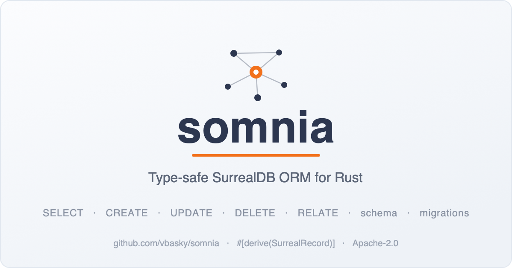

# somnia



[](https://crates.io/crates/somnia)
[](https://crates.io/crates/somnia)
[](https://docs.rs/somnia)
[](https://github.com/vbasky/somnia/actions/workflows/ci.yml)
[](#status)
[](#license)
[](https://medium.com/@vbasky/somnia-a-type-safe-orm-for-surrealdb-that-feels-like-diesel-7341d49bd5c4)
[](https://github.com/vbasky/somnia/stargazers)
[](https://github.com/vbasky)

**A type-safe [SurrealDB](https://surrealdb.com) ORM for Rust** — a typed query
builder, a `#[derive(SurrealRecord)]` macro, schema generation, and Diesel-style
migrations.

> *somnia* — Latin for "dreams". SurrealDB is *surreal* (dreamlike); somnia is
> where your Rust types dream in SurrealQL.

```toml
[dependencies]
somnia = "0.5"
```

---

## Why

Writing SurrealQL as hand-spliced strings is error-prone: typo'd table names,
unescaped values, record-link mistakes, and projection drift. `somnia` lets your
Rust types describe the schema once and gives you:

- **Typed query building** — `Post::table().select(...).filter(Post::title().eq("hello"))`
- **Graph traversal** — query across `RELATE` edges with typed paths
  (`Path::out::<Wrote>().to::<Post>()`), including recursive `@.{..}` paths.
- **`#[derive(SurrealRecord)]`** — typed column accessors, table metadata, and
  schema DDL generated from the struct.
- **Schema as code** — `up()` / `down()` emit `DEFINE TABLE` / `DEFINE FIELD` /
  `DEFINE INDEX` / `REMOVE TABLE` from the Rust type.
- **Diesel-style migrations** — a `Migrator` that applies `up.surql` /
  reverts `down.surql` from timestamped folders, with applied-state tracking.
- **The rest of SurrealQL, typed** — atomic transactions, `$param` binding,
  subqueries, `IF`/`FOR` control flow, and `DEFINE EVENT`/`FUNCTION`/`ANALYZER`/
  `PARAM` — so you rarely drop to `Raw(...)`.

`somnia` **inlines literals** (with proper escaping) rather than relying on bind
parameters — `to_surrealql()` returns a ready-to-run statement string, which keeps
generated queries transparent and easy to log.

## Quick start

### Define a record

```rust
use somnia::{SurrealRecord, Thing};
use serde::{Deserialize, Serialize};

#[derive(Debug, Clone, Serialize, Deserialize, SurrealRecord)]
#[table("post")]
struct Post {
    #[field(thing)]
    id: Thing<Post>,
    title: String,
    body: String,
    published_at: Option<String>,
}
```

### Build queries

```rust
use somnia::{col, field, ident, RecordLink, Returning};

// SELECT with typed columns + function-wrapped projections
let sql = Post::table()
    .project(vec![
        field("record::id(id)", "id"),
        col("title"),
        field("type::string(published_at)", "published_at"),
    ])
    .filter(Post::published_at().ne(None))
    .order_desc(ident("published_at"))
    .limit(20)
    .to_surrealql();

// CREATE … with record links
let create = Post::table()
    .create()
    .record("post-1".to_string())
    .set_lit("title", "Hello, world".to_string())
    .set_expr("author", RecordLink::new("author", "bob".to_string()))
    .set_raw("published_at", "time::now()")
    .returning(Returning::After)
    .to_surrealql();

// UPSERT — update the record if it exists, otherwise create it
let upserted = Post::table()
    .upsert()
    .record("post-1".to_string())
    .set_lit("title", "Hello again".to_string())
    .returning(Returning::After)
    .to_surrealql();

// CREATE then SELECT back with typed projections
let batch = Post::table()
    .create()
    .record("post-1".to_string())
    .set_lit("title", "Hello, world".to_string())
    .set_expr("author", RecordLink::new("author", "bob".to_string()))
    .set_raw("published_at", "time::now()")
    .returning(Returning::After)
    .then_select(
        Post::table()
            .project(vec![
                field("record::id(id)", "id"),
                col("title"),
                field("type::string(published_at)", "published_at"),
            ])
            .limit(1),
    );

// UPDATE / DELETE with RETURN variants
let del = Post::table()
    .delete()
    .filter(ident("id").eq_expr(RecordLink::new("post", "post-1".to_string())))
    .returning(Returning::Before)
    .to_surrealql();

// Graph traversal across RELATE edges (`Wrote`/`Knows` are `SurrealEdge` types)
use somnia::Path;

// SELECT ->wrote->post.title AS titles FROM author
let titles = Author::table()
    .project_path(Path::out::<Wrote>().to::<Post>().field("title"), "titles")
    .to_surrealql();

// Recursive paths: every author within 3 "knows" hops
let network = Author::table()
    .project_path(Path::out::<Knows>().to::<Author>().recurse_up_to(3), "network")
    .to_surrealql();
```

For SurrealQL that isn't modeled as typed nodes (lambdas, `IF/THEN/ELSE`,
`string::*` chains), use the `Raw(...)` / `field("…raw…", "alias")` escape hatch —
the builder still owns the statement structure, table names, and record links.

### Schema as code

`#[derive(SurrealRecord)]` also implements `SurrealSchema`:

```rust
use somnia::SurrealSchema;

#[derive(Debug, Clone, Serialize, Deserialize, SurrealRecord)]
#[table("comment")]
struct Comment {
    #[field(thing)] id: Thing<Comment>,
    #[field(record = "post")] post: serde_json::Value,
    body: String,
    #[field(ty = "datetime", default = "time::now()")] created_at: String,
}

Comment::up();   // DEFINE TABLE … ; DEFINE FIELD … ;
Comment::down(); // REMOVE TABLE IF EXISTS comment;
```

Field attributes: `#[field(thing)]` (record id), `record = "table"`
(`record<table>`), `default = "…"`, `value = "…"`, `ty = "…"` (full type
override), `flexible`, `name = "…"`, `skip`. Table attributes:
`#[table("name")]`, `#[table("name", schemaless, permissions = "NONE")]`.

Field types are mapped from the Rust type — including typed arrays
(`Vec<T>` → `array<…>`), `Option<…>`, records, `duration`, and `decimal`.

Add indexes with a repeatable container attribute; they're emitted by `up()`
(after the fields) and exposed via `SurrealSchema::define_indexes()`:

```rust
#[derive(Debug, Clone, Serialize, Deserialize, SurrealRecord)]
#[table("member")]
#[index(name = "member_email_unique", fields = "email", unique)]
struct Member {
    #[field(thing)] id: Thing<Member>,
    email: String,
}
```

For ad-hoc or richer indexes (full-text `SEARCH`, vector `HNSW`/`MTREE`), use the
`DefineIndex` builder directly.

### Migrations

Lay out migrations Diesel-style — one timestamped folder per migration with
`up.surql` and `down.surql`:

```bash
migrations/
  2025-01-01-000000_create_posts/
    up.surql
    down.surql
  2025-01-01-000100_seed_defaults/
    up.surql
    down.surql
```

```rust
use somnia::SomniaClient;

let client = SomniaClient::connect("ws://localhost:8000", "root", "root", "ns", "db").await?;
let migrator = client.migrator("migrations");

migrator.run().await?;          // apply all pending up.surql in order
migrator.revert_last().await?;  // run the latest down.surql
for m in migrator.status().await? {
    println!("{} {}", if m.applied { "✓" } else { " " }, m.id);
}
```

Applied migrations are tracked in a `_somnia_migrations` table, so re-running only
applies what's pending.

### More query power

Beyond CRUD, somnia models much of SurrealDB's surface as typed builders:

```rust
use somnia::{col, ident, Transaction, IfExpr, For, DefineEvent, DefineFunction, Raw};

// Atomic transaction — all statements commit, or none do
let tx = Transaction::new()
    .push(Post::table().create().record("p1".to_string()).set_lit("title", "Hi".to_string()))
    .push("UPDATE counter SET posts += 1")
    .to_surrealql(); // BEGIN TRANSACTION; … ; COMMIT TRANSACTION;

// $param binding instead of inlined literals
let (sql, params) = Post::table()
    .select(Post::all())
    .filter(Post::title().eq("hello".to_string()))
    .to_surrealql_with_params(); // ("… WHERE title = $p0", { p0: "hello" })

// Subqueries + IN — a Select is usable as an expression
let recent = Post::table().project(vec![col("id")]).value().filter(Raw("published".into()));
let sql = Comment::table()
    .select(Comment::all())
    .filter(ident("post").in_expr(recent))
    .to_surrealql();

// SELECT modifiers: VALUE / OMIT / SPLIT / WITH INDEX / TIMEOUT / EXPLAIN
let sql = Post::table().select(Post::all()).omit("body").timeout("5s").to_surrealql();

// Control flow as expressions
let label = IfExpr::new(Raw("votes > 100".into()), Raw("'hot'".into())).else_(Raw("'normal'".into()));
let seed = For::new("n", Raw("[1, 2, 3]".into())).push("CREATE counter SET v = $n");

// Schema DDL beyond tables/fields/indexes
let ev = DefineEvent::new("on_publish", "post")
    .when("$event = 'UPDATE'").then("{ CREATE log SET at = time::now() }").to_surrealql();
let f = DefineFunction::new("greet").arg("name", "string").returns("string")
    .body("RETURN 'hi ' + $name;").to_surrealql();
```

Edge records can derive their `SurrealEdge` impl: `#[derive(SurrealRecord, SurrealEdge)]`.

## Crates

| Crate | Description |
| ------- | ------------- |
| [`somnia`](crates/somnia) | Umbrella crate: client, migrator, re-exports. Start here. |
| [`somnia-core`](crates/somnia-core) | Query builder, expression tree, `SurrealRecord`/`SurrealSchema` traits. |
| [`somnia-derive`](crates/somnia-derive) | `#[derive(SurrealRecord)]` / `#[derive(SurrealEdge)]` proc-macros. |
| [`somnia-cli`](crates/somnia-cli) | Diesel-cli-style migration runner (the `somnia` binary). |

## CLI

A standalone migration runner, modeled on `diesel-cli`. Install it with Cargo or
Homebrew (both provide the `somnia` binary):

```bash
cargo install somnia-cli                       # from crates.io
brew tap vbasky/somnia && brew install somnia  # Homebrew (macOS / Linux)
```

Then:

```bash
somnia migration generate create_posts    # scaffold a timestamped up/down folder
somnia migration run                      # apply all pending migrations
somnia migration revert                   # revert the latest
somnia migration redo                     # revert + re-apply the latest
somnia migration list                     # show applied / pending
```

Connection settings are read from flags or environment variables (`--help` for
the full list).

## Status

`0.5.x` — early but tested against SurrealDB 3.x (query builder, derive, schema
generation, and migrator all covered by integration tests that run on an
in-memory engine). The API may evolve before `1.0`. See the
[roadmap](ROADMAP.md) for what's covered today and what's planned on the way to
`1.0`.

**MSRV:** Rust **1.95** (set by the SurrealDB 3.x dependency tree). Bumping the
minimum supported Rust version is treated as a minor-version change.

## License

Licensed under the [Apache License, Version 2.0](LICENSE).

Unless you explicitly state otherwise, any contribution intentionally submitted
for inclusion in the work by you, as defined in the Apache-2.0 license, shall be
licensed as above, without any additional terms or conditions.
